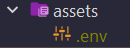

# SPRINT_PROJECT
Proyecto clase 2DAM segundo trimestre 23/24
# USO PARA DESARROLLADORES
En caso de ser un desarrollador que quiere trabajar en el proyecto deberá configurar el entorno 
para que la ejecución contenga las variables de entorno que permitan el acceso a los endpoints que 
usamos, para ello se debe descargar el archivo ".env" del servidor de Discord oficial y guardarlo 
en la carpeta "assets del proyecto"  

> **Nota:**  
> El archivo ".env" se encuentra en el Discord de desarrolladores
