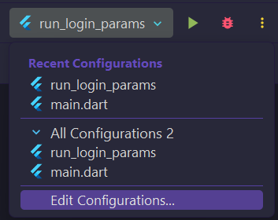
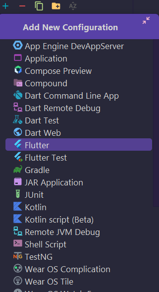
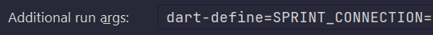

# SPRINT_PROJECT
Proyecto clase 2DAM segundo trimestre 23/24
Test
# USO PARA DESARROLLADORES
En caso de ser un desarrollador que quiere trabajar en el proyecto deberá configurar el entorno (preferiblemente Android Studio) para que la ejecución contenga las variables de entorno que permitan el acceso a la base de datos de odoo que estamos usando, para ello hay que seguir los siguientes pasos:
- Desplegar el botón de configuraciones de ejecución (a la izquierda del botón de ejecución)  

- Pulsar en "Editar configuraciones" y agregar una nueva configuración en el botón de "+" en la parte superior izquierda de la ventana y seleccionar "Flutter"  

- Darle el nombre que se desee y en el apartado de "Argumentos adicionales de ejecución" añadir:
  - "--dart define=SPRINT_USER={usuario}"
  - "--dart define=SPRINT_PASSWORD={contraseña}"
  - "--dart define=SPRINT_DATABASE={baseDeDatos}"
  - "--dart define=SPRINT_CONNECTION={url}"  

> **Nota:**
> Para saber cuales son los datos se debe tener acceso al discord, donde estará la información de la conexión

teste2 asd